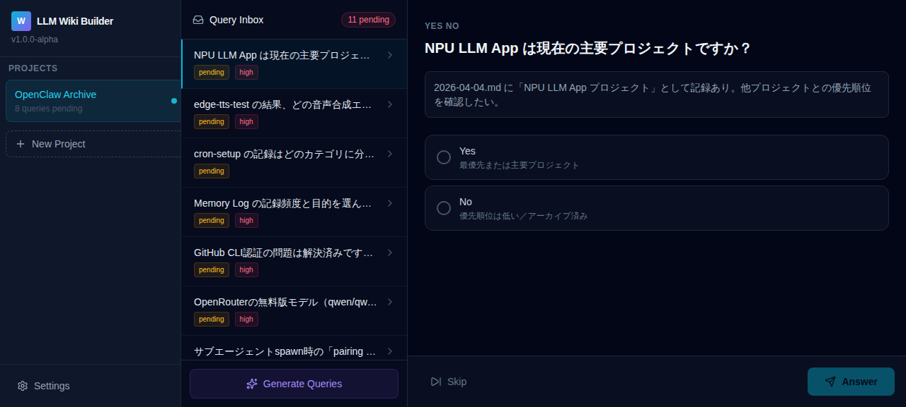
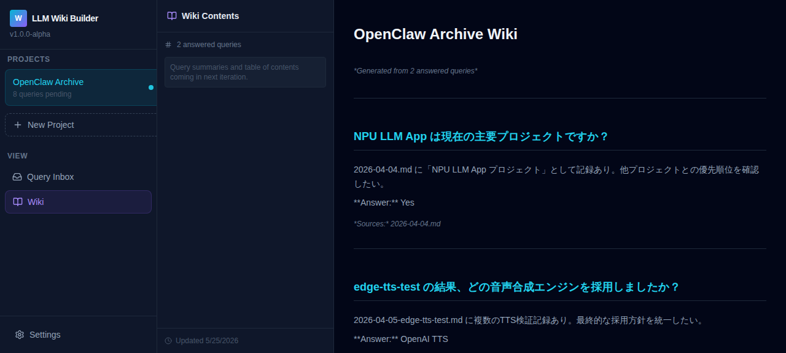

# LLM Wiki Builder

> Turn your raw notes into a structured, query-driven knowledge base.
> Inspired by [Andrej Karpathy's LLM Wiki pattern](https://gist.github.com/karpathy/442a6bf555914893e9891c11519de94f).

---

## 📸 Demo

| Query Inbox | Wiki View |
|------------|-----------|
|  |  |

---

## ✨ Features

- **📥 Query Inbox** — Review LLM-generated questions about your raw notes. Answer with Yes/No, Single Select, or Multi Select.
- **📖 Wiki View** — Automatically compile answered queries into a markdown wiki page with sources.
- **⚡ Generate Queries** — Feed your raw `.md` files to an LLM and auto-generate structured questions. Zero API cost via Hermes/OpenCode Go integration.
- **📁 Project Management** — Organize multiple knowledge bases (e.g., work, personal, research).
- **🖥️ Desktop Ready** — Tauri scaffold included for native desktop builds.

---

## 🛠 Tech Stack

| Layer | Technology |
|-------|------------|
| Frontend | React 19, TypeScript, TailwindCSS, TanStack Query, Zustand |
| Build Tool | Vite 7 |
| Desktop | Tauri v2 (Rust) |
| LLM Client | OpenCode Go API (zero-cost via Hermes auth) |
| Scripts | Python 3.12 |

---

## 🚀 Quick Start

### Prerequisites

- Node.js 22+
- Python 3.12+
- uv (optional but recommended) or pip

### 1. Install Frontend Dependencies

```bash
npm install
```

### 2. Start Dev Server

```bash
npx vite --host
# → http://localhost:1420
```

### 3. (Optional) Generate Queries from Your Notes

```bash
# 1. Index your raw markdown files
export RAW_DIR="/path/to/your/raw/notes"
python scripts/index_files.py

# 2. Generate queries via LLM (uses Hermes OpenCode Go API — no extra key needed)
python scripts/generate_queries.py

# 3. Inject into the mock API for instant preview
python scripts/inject_mock.py
```

> **Note:** If `opencode_go_client` is not in your `PYTHONPATH`, add the path to the `roblox-auto-merchant/agent/src` directory or copy the module into `scripts/`.

---

## 🏗 Architecture

```
┌─────────────────────────────────────────────┐
│              Frontend (Vite SPA)             │
│  React + TS + Tailwind + TanStack Query     │
│                                               │
│  ┌──────────────┐  ┌──────────────┐          │
│  │ Query Inbox  │  │  Wiki View   │          │
│  └──────────────┘  └──────────────┘          │
└──────────────────┬────────────────────────────┘
                   │
         ┌─────────▼──────────┐
         │   Mock API Layer   │
         │  (src/lib/api.ts)  │
         └─────────┬──────────┘
                   │
    ┌──────────────┼──────────────┐
    │              │              │
┌───▼────┐   ┌────▼────┐   ┌─────▼──────┐
│ Python │   │ OpenCode│   │   Tauri    │
│Scripts │   │ Go API  │   │  (Rust)    │
└────────┘   └─────────┘   └────────────┘
```

---

## ⚙️ Environment Variables

For Python scripts:

| Variable | Description | Default |
|----------|-------------|---------|
| `RAW_DIR` | Path to raw markdown files | *(required)* |
| `INDEX_OUTPUT` | Output path for file index | `data/file_index.json` |
| `MAX_FILE_SIZE` | Skip files larger than this | `10MB` |

---

## 📂 Project Structure

```
llm-wiki-builder/
├── src/                    # React frontend
│   ├── components/         # QueryInbox, WikiView, QueryCard, Sidebar...
│   ├── hooks/              # TanStack Query hooks
│   ├── lib/                # API layer (mock + OpenCode Go client)
│   ├── stores/             # Zustand state management
│   └── types/              # TypeScript types
├── scripts/                # Python automation
│   ├── index_files.py      # File indexer
│   ├── generate_queries.py # LLM query generator
│   └── inject_mock.py      # Inject into dev API
├── src-tauri/              # Rust / Tauri desktop app
├── assets/                 # Screenshots, images
└── docs/                   # Design docs (API_SPEC, DESIGN, PLAN...)
```

---

## 🗺 Roadmap

- [ ] TOC navigation in Wiki View
- [ ] Real backend API (replace mocks)
- [ ] Batch query generation for large archives
- [ ] Full-text search across wiki
- [ ] Export to Markdown / PDF
- [ ] Tauri desktop release builds

---

## 🤝 Credits

- [Andrej Karpathy](https://gist.github.com/karpathy/442a6bf555914893e9891c11519de94f) for the LLM Wiki pattern
- [Hermes Agent](https://github.com/nousresearch/hermes) for the OpenCode Go API integration

---

## 📄 License

MIT
